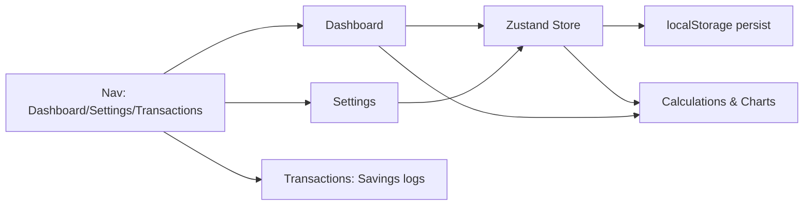

# Retirement Saver App Plan

## Overview
React app to incentivize saving by projecting retirement age based on income, spending, savings, and investment growth adjusted for inflation.

## Key Requirements
- Dashboard: Inputs for current age, current savings, monthly income, spending categories (+/- buttons), retirement goal. Display projected retirement age with feedback emoji. Charts.
- Settings: Inflation (default 3%), Interest (default 7%) annual rates.
- Repurpose Transactions for savings-related logs.
- localStorage persistence.
- Monthly compounding.

## Data Models
```typescript
interface SpendingCategory {
  name: string;
  monthlySpend: number;
}

interface AppState {
  currentAge: number;        // years, default 30
  currentSavings: number;    // dollars, default 0
  monthlyIncome: number;     // dollars/month, default 5000
  categories: SpendingCategory[];  // defaults below
  retirementGoal: number;    // dollars, default 1000000
  annualInflation: number;   // e.g. 0.03
  annualInterest: number;    // e.g. 0.07
  previousRetirementAge: number | null;  // for feedback
}
```

**Default Categories:**
- Rent: $1500
- Utilities: $200
- Food: $500
- Transportation: $300
- Entertainment: $200
- Other: $300

## Calculation Logic
1. `monthlySavings = monthlyIncome - sum(category.monthlySpend)`
2. `monthlyRate = Math.pow(1 + annualInterest/12, 1) / Math.pow(1 + annualInflation/12, 1) - 1`
3. Future Value: `FV(n) = currentSavings * (1 + r)^n + monthlySavings * ((1 + r)^n - 1) / r`
4. Find minimal whole months `n` where `FV(n) >= retirementGoal` (binary search or loop).
5. `retirementAge = Math.floor(currentAge + n / 12)`

**Edge cases:** If monthlySavings <=0, cannot retire or infinite. Handle gracefully.

```mermaid
flowchart TD
  A[User Inputs] --> B[monthlySavings = income - totalSpend]
  B --> C[r_monthly = (1 + interest/12) / (1 + inflation/12) - 1]
  C --> D[FV_n = currentSavings * pow + monthlySavings * ((1+r)^n -1)/r]
  D --> E[Loop/Binary search: min n where FV_n >= goal]
  E --> F[retirementAge = floor(currentAge + n/12)]
  F --> G[Display age + chart]
```

## App Flow


## Zustand Store Design
Single store `useRetirementStore`:
```typescript
import { create } from 'zustand';
import { persist } from 'zustand/middleware';

const defaultCategories: SpendingCategory[] = [...];

const useRetirementStore = create(
  persist(
    (set, get) => ({
      // state...
      currentAge: 30,
      previousRetirementAge: null,
      // ... defaults

      updateIncome: (income: number) => set({ monthlyIncome: income }),
      updateCategory: (name: string, spend: number) => {
        set(state => ({
          categories: state.categories.map(c => c.name === name ? {...c, monthlySpend: spend} : c)
        }));
      },
      // similar for others
      computeRetirementAge: () => {
        const age = ... // calc
        const prev = get().previousRetirementAge;
        set({ previousRetirementAge: age });
        return { age, feedback: prev && age < prev ? '😊' : prev && age > prev ? '😞' : '' };
      }
    }),
    { name: 'retirement-saver' }
  )
);
```

## UI Components Plan
### Dashboard
- Header: "Retirement Projection"
- Section 1: Inputs
  - NumberInput: Current Age (25-70)
  - CurrencyInput: Current Savings
  - CurrencyInput: Monthly Income
  - CurrencyInput: Retirement Goal
- Section 2: Spending Categories (Grid)
  - For each: Label, Value display, Buttons: -10, -5, -1, +1, +5, +10 (adjust monthly spend)
  - Total Spend display
- Section 3: Projected Retirement Age (big number) + feedback: 😊 if lower than previous (better), 😞 if higher (worse)
- Section 4: Chart (Recharts Line: Savings over years to retirement)

### Settings
- Sliders/Inputs: Annual Inflation %, Annual Interest %
- Defaults shown

### Transactions
- List projected monthly savings
- Or log changes to inputs over time (from localStorage history?)

## Next Steps
Implement via todos. Use Recharts for charts, Lucide for icons.